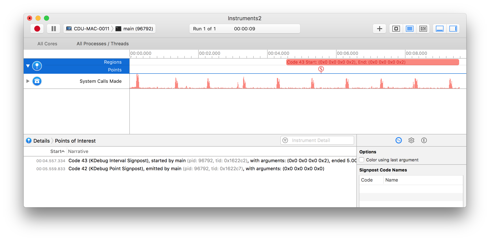

# Instruments

A small golang library that allows you to send signals to Instruments.app to indicate interesting points or regions,
modeled after the [Ruby library by Alloy](https://github.com/alloy/instruments)

For more info about Instruments and the ‘Points of Interest’ instrument, see
[these slides](http://devstreaming.apple.com/videos/wwdc/2016/411jge60tmuuh7dolja/411/411_system_trace_in_depth.pdf).

Note that this uses the `kdebug_signpost` API, which is only available since macOS 10.12.

## Example

Consider the following process:

```golang
package main

import (
	"fmt"
	"time"

	"github.com/nicolai86/instruments"
)

func main() {
	fmt.Printf("Hello world\n")
	time.Sleep(10 * time.Second)

	go func() {
		<-time.After(1 * time.Second)
		instruments.Signpost(42)
	}()

	region := instruments.StartWithArguments(43, 0, 0, 0, instruments.ColorPurple)

	time.Sleep(5 * time.Second)

	region.End()
}
```

When attaching Instruments.app using the ‘Points of Interest’ instrument you’d get the following:


